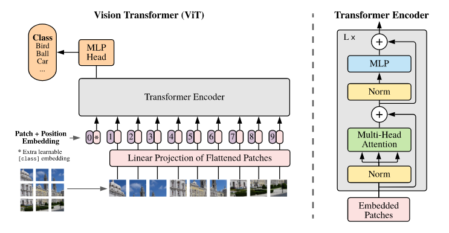

# Vision transformer

Our implementation of paper: [An Image is Worth 16x16 Words: Transformers for Image Recognition at Scale](https://arxiv.org/abs/2010.11929), using [tensorflow 2](https://www.tensorflow.org/)



> Vision transformer model architecture (figure from the paper)

Author:

- Github: bangoc123 and tiena2cva
- Email: protonxai@gmail.com

### I. Set up environment

1. Make sure you have installed Miniconda. If not yet, see the setup document [here](https://conda.io/en/latest/user-guide/install/index.html#regular-installation).

2. Clone this repository: `git clone https://github.com/bangoc123/vit`
3. `cd` into `vit` and install dependencies package: `pip install -r requirements.txt`

### II. Set up your dataset.

Create 2 folders `train` and `validation` in the `data` folder (which was created already). Then `Please copy` your images with the corresponding names into these folders.

- `train` folder was used for the training process
- `validation` folder was used for validating training result after each epoch

This library use `image_dataset_from_directory` API from `Tensorflow 2.0` to load images. Make sure you have some understanding of how it works via [its document](https://www.tensorflow.org/api_docs/python/tf/keras/preprocessing/image_dataset_from_directory).

Structure of these folders.

```
main_directory/
...class_a/
......a_image_1.jpg
......a_image_2.jpg
...class_b/
......b_image_1.jpg
......b_image_2.jpg
```

### III. Train your model by running this command line

We create `train.py` for training model.

```
usage: train.py [-h] [--model MODEL] [--num-classes CLASSES]
                [--patch-size PATH_SIZE] [--num-heads NUM_HEADS]
                [--att-size ATT_SIZE] [--num-layer NUM_LAYER]
                [--mlp-size MLP_SIZE] [--lr LR] [--batch-size BATCH_SIZE]
                [--epochs EPOCHS] [--image-size IMAGE_SIZE]
                [--image-channels IMAGE_CHANNELS] [--train-folder TRAIN_FOLDER]
                [--valid-folder VALID_FOLDER] [--model-folder MODEL_FOLDER]

optional arguments:
  -h, --help            
    show this help message and exit

  --model MODEL       
    Type of ViT model, valid option: custom, base, large, huge

  --num-classes CLASSES     
    Number of classes
  
  --patch-size PATH_SIZE
    Size of image patch
  
  --num-heads NUM_HEADS
    Number of attention heads
  
  --att-size ATT_SIZE   
    Size of each attention head for value
  
  --num-layer NUM_LAYER
    Number of attention layer
  
  --mlp-size MLP_SIZE   
    Size of hidden layer in MLP block
  
  --lr LR               
    Learning rate
  
  --batch-size BATCH_SIZE
    Batch size
  
  --epochs EPOCHS       
    Number of training epoch
  
  --image-size IMAGE_SIZE
    Size of input image
  
  --image-channels IMAGE_CHANNELS
    Number channel of input image
  
  --train-folder TRAIN_FOLDER
    Where training data is located
  
  --valid-folder VALID_FOLDER
    Where validation data is located
  
  --model-folder MODEL_FOLDER
    Folder to save trained model
```

There are some `important` arguments for the script you should consider when running it:

- `train-folder`: The folder of training images
- `valid-folder`: The folder of validation images
- `num-classes`: The number of your problem classes.
- `batch-size`: The batch size of the dataset
- `lr`: The learning rate of Adam Optimizer
- `model-folder`: Where the model after training saved
- `model`: The type of model you want to train. If you want to train with `base` or `large` or `huge` model, you need to specify `patch-size`, `num-heads`, `att-size` and `mlp-size` argument.

Example:

You want to train a model in 10 epochs for binary classification problems (with 2 classes)

```bash
!python train.py --train-folder ${train_folder} --valid-folder ${valid_folder} --num-classes 2 --patch-size 5 --image-size 150 --lr 0.0001 --epochs 200 --num-heads 12 
```

After training successfully, your model will be saved to `model-folder` defined before

### IV. Testing model with a new image

We offer a script for testing a model using a new image via a command line:

```bash
python predict.py --test-image ${test_image_path}
```

where `test_image_path` is the path of your test image.

Example:

```bash
python predict.py --test-image ./data/test/cat.2000.jpg
```
